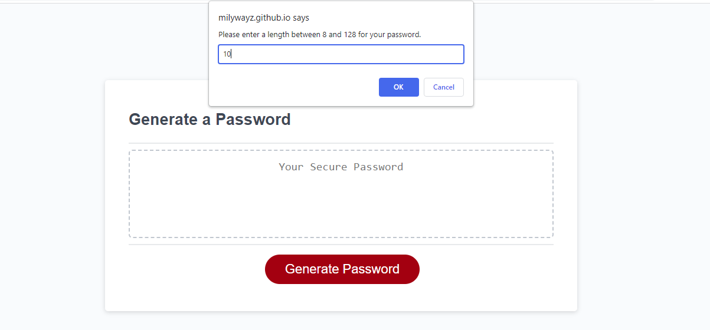
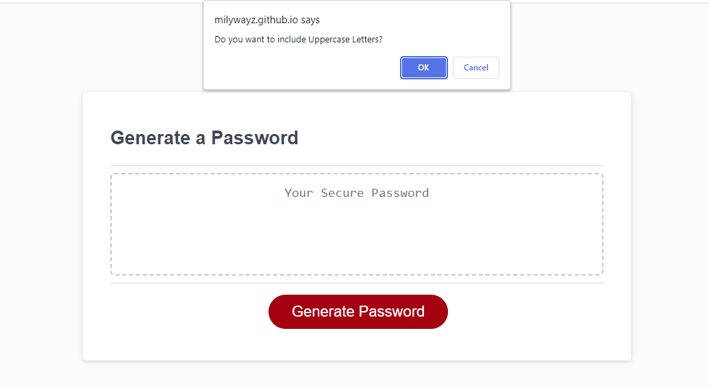
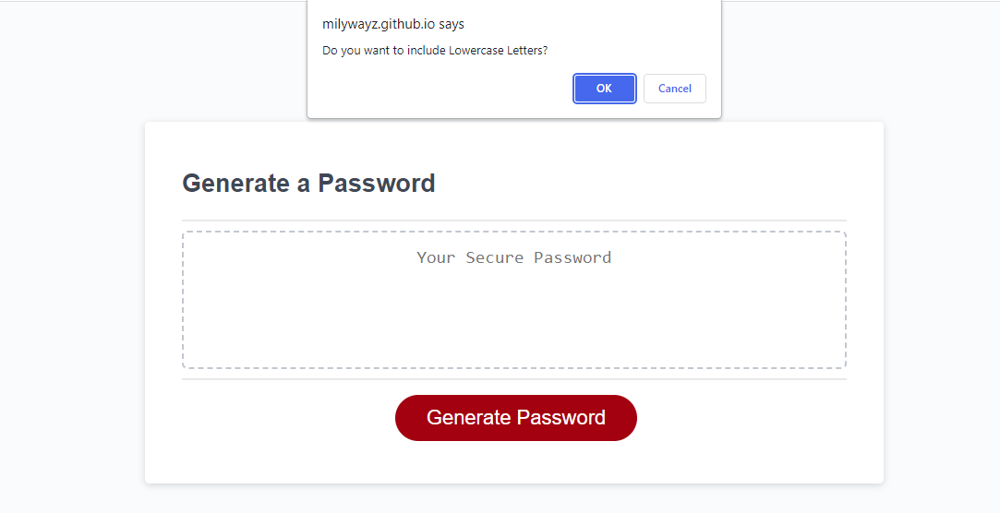
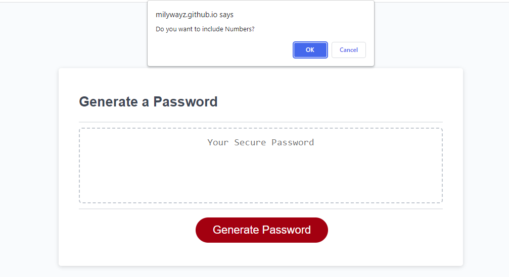
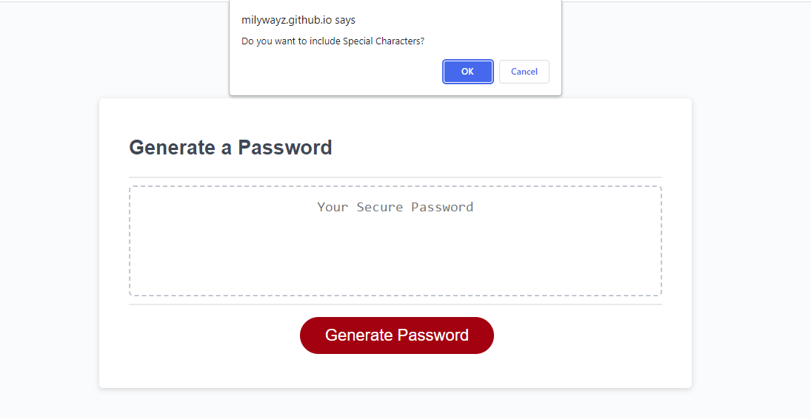
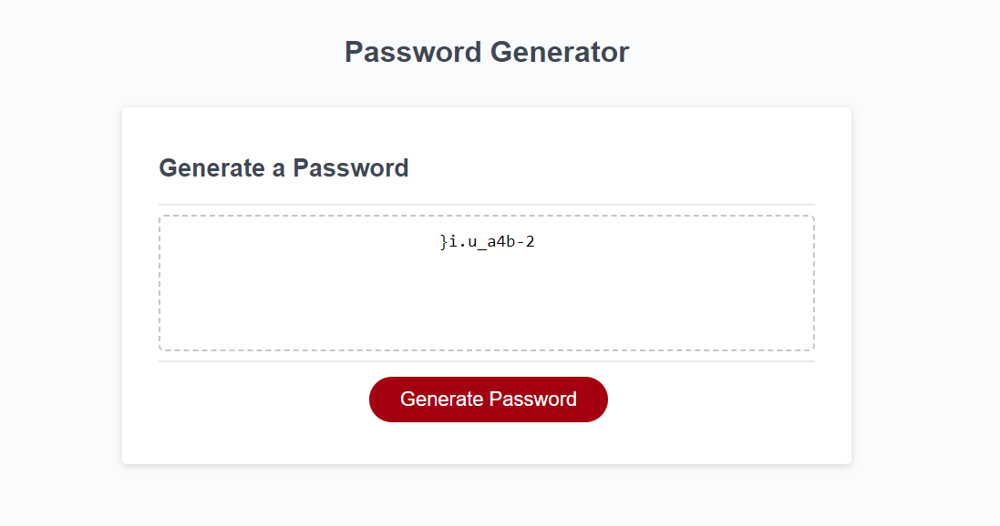
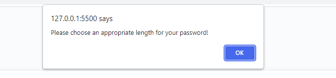
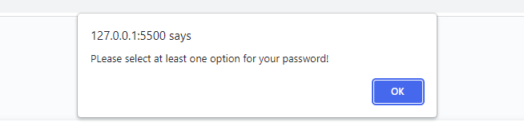

# JavaScript: Password Generator

## Link to Deployed Application

https://milywayz.github.io/Password-Generator/

## Description

This project was made to practice using HTML, CSS, and JavaScript. The JavaScript is used with variables, functions, if statements, and arrays. Using these practices together, it will create a password generator for use when you submit in your selected options.

## Installation

N/A

## Usage

The usage of this application is to generate a random new password after given the options the user selected. 
Password Length, Uppercase Alphabet, Lowercase Alphabet, Numbers, and Special Character Options for the user to select. 

   
## License

N/A

## Features

Password Length Option:

Use of Uppercase Alphabet:

Use of Lowercase Alphabet:

Use of Numbers:

Use of Special Characters:

Final Result with all options selected:

Warning if you don't use the correct password length:

Warning if you didn't select any of options given:
